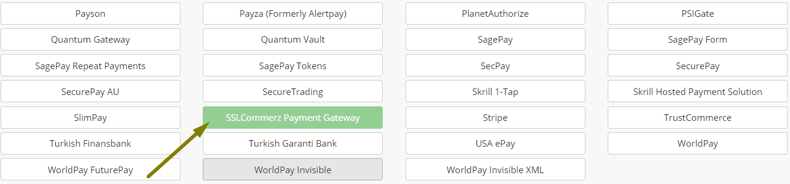
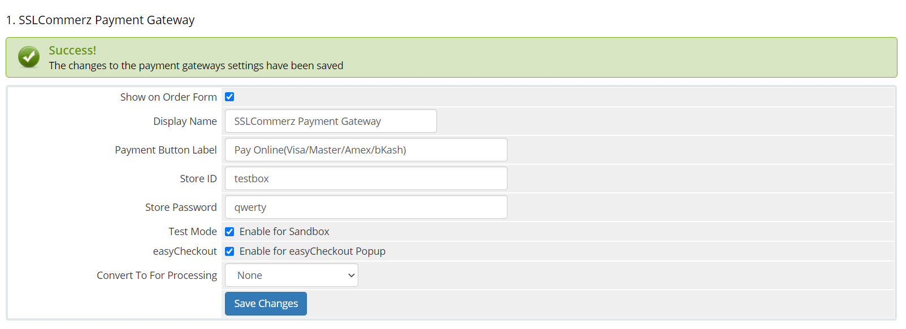
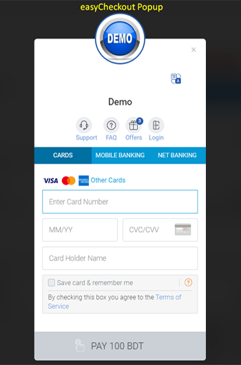
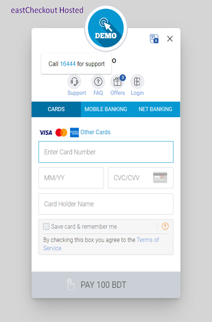

# SSLCommerz-WHMCS

SSLCOMMERZ is the first payment gateway in Bangladesh opening doors for merchants to receive payments on the internet via their online stores. Their customers will be able to buy products online using their credit cards as well as bank accounts. If you are a merchant, you have come to the right place! We are providing SSLCommerz Payment Gateway for WHMCS.

### Prerequisites

1. WHMCS V6-V7
2. cURL php extension.
3. [Sandbox Account](https://developer.sslcommerz.com/registration/ "SSLCommerz Sandbox Registration")

### Change Log

1. New version 4 API.
2. New easyCheckout Hosted & Popup UI.
3. Dynamic IPN URL(Auto Configure)
4. Tested upto V7.5.1 R2

### How to install the WHMCS module?

To install the WHMCS payment module, follow the instructions below:

1. Download the WHMCS payment module from github page.
2. Unzip the module to a temporary location on your computer.
3. Copy the `modules` folder from the archive to your base `whmcs` folder (using FTP program or similar)
4. This should NOT overwrite any existing files or folders and merely supplement them with the SSLWireless files
5. Login to the WHMCS Administrator console
6. Using the main menu, navigate to `Setup > Payments > Payment Gateways`
7. Select `SSLCommerz Payment Gateway` from the `All Payment Gateways` drop-down list and click `Activate`
8. Enter the following details under the `SSLCommerz Payment Gateway` heading: 
`Display Name` = <Enter your display name>
`Payment Button Label` = <Checkout button Name>
`Store ID` = <Test/Live store id>
`Store Password` = <Test/Live password>
`Test Mode` = <Enable for test mode>
`easyCheckout` = <Enable for easy popup>
Click `Save Changes`
* Check image referance.
9. The module is now and ready.

### Image Reference

> Payment Methods

> Gatway Configuration Page

> easyCheckout Popup

> easyCheckout Hosted

## Frequently Asked Questions

### I want my customer will bear the gateway charges. How can I do that?
> Yes, We have solution for this, you can configure this from your merchant panel or mail to `operation@sslcommerz.com` .

### What is the Minimum amount of transaction?
> The minimum amount of transaction should be more than `10TK` .

### What is the API Version?
> We are using API V4.

### How to switch at easyCheckout Popup PG?
> To switch at easyCheckout Popup PG, enable `easyCheckout` checkbox.

### Is this module support IPN?
> Yes, this module supported dynamic IPN. So you don't need to setup any IPN URL to the merchant panel.

### To know more visit [Developer Page](https://developer.sslcommerz.com/doc/v4/#easy-chechout "SSLCommerz Developer Page")

- Author : SSLCOMMERZ
- Developed By: Prabal Mallick
- Team Email: integration@sslcommerz.com (For any query)
- About SSLCommerz: https://www.sslcommerz.com

© 2020 SSLCOMMERZ ALL RIGHTS RESERVED