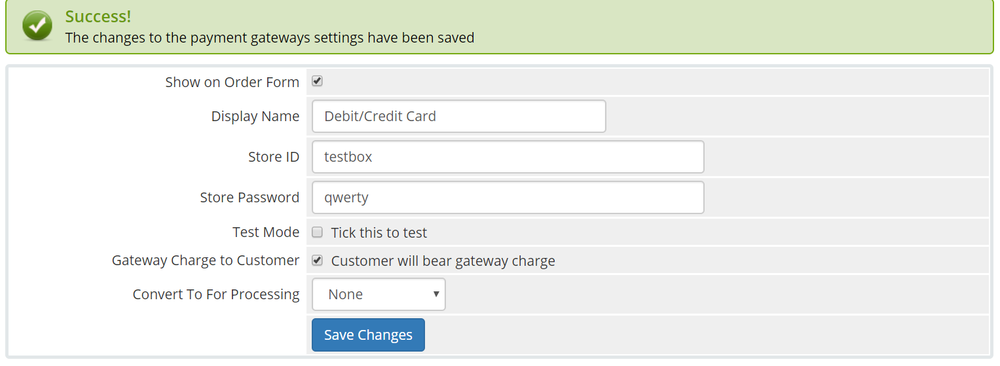

# WHMCMS-sslcommerz-v6

SSLCOMMERZ is the first payment gateway in Bangladesh opening doors for merchants to receive payments on the internet via their online stores. Their customers will be able to buy products online using their credit cards as well as bank accounts. If you are a merchant, you have come to the right place! We are providing SSLCommerz Payment Gateway for WHMCS.

### Prerequisites

1. WHMCS V6-V7
2. cURL php extension.
3. [Sandbox Account](https://developer.sslcommerz.com/registration/ "SSLCommerz Sandbox Registration")

### How do I install the WHMCS module?

To install the WHMCS payment module, follow the instructions below:

1. Download the WHMCS payment module WHMCMS-sslcommerz-v6.
2. Unzip the module to a temporary location on your computer.
3. Copy the `modules` folder from the archive to your base `whmcs` folder (using FTP program or similar)
4. This should NOT overwrite any existing files or folders and merely supplement them with the SSLWireless files
5. Login to the WHMCS Administrator console
6. Using the main menu, navigate to Setup ? Payment Gateways
7. Select `SSLCommerz` from the `Activate Gateway` drop-down list and click `Activate`
8. Enter the following details under the `SSLCommerz` heading: 
Store ID = <Integration page>
Store Password = <Integration page>
Test Mode =
Click `Save Changes`
9. The module is now and ready.

### Image Reference

## Frequently Asked Questions

### I want my customer will bear the gateway charges. How can I do that?
> Yes, We have solution for this, you can configure this from your merchant panel or mail to `operation@sslcommerz.com` .

### What is the Minimum amount of transaction?
> The minimum amount of transaction should be more than `10TK` .

### What is the API Version?
> We are using API V3.0 & 3.5 middle tire, wchich will redirect to our New V4 API and able to get easyCheckout UI.

### How to switch at easyCheckout Hosted PG?
> To switch at easyCheckout Hosted PG, uncheck the `Customer will bear gateway charge` and enable it from merchant panel.

### Is this module support IPN?
> No, currently IPN is not supported for this module.

### How to integrate easyCheckout Popup?
> You can update the module with the help of our [Developer Page](https://developer.sslcommerz.com/doc/v4/#easy-chechout "SSLCommerz Developer Page")